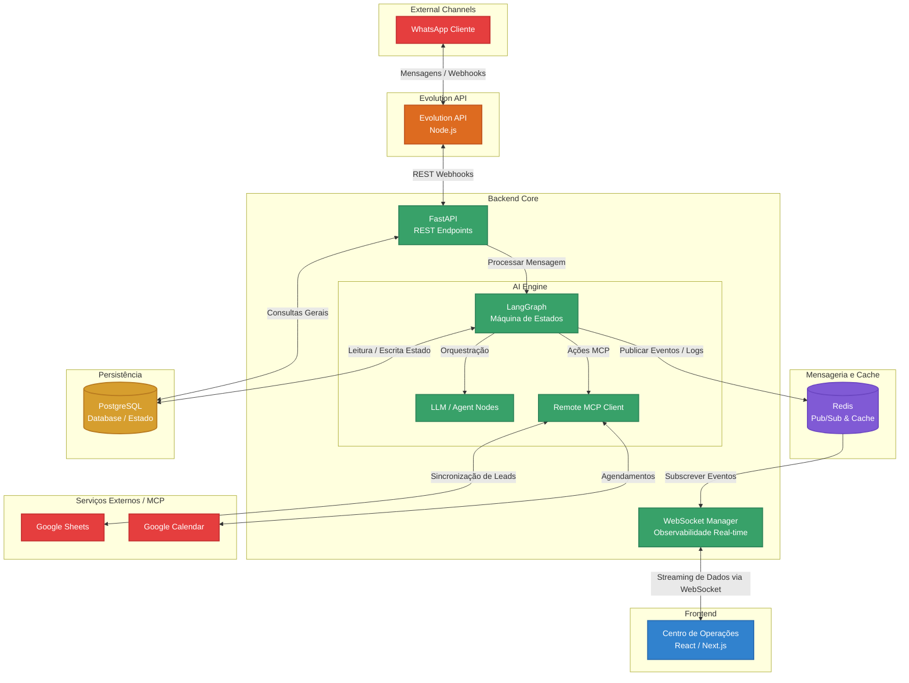

# Arquitetura Geral do Agente de Vendas

Este documento descreve a arquitetura geral da solução do Agente de Atendimento e Vendas, detalhando as tecnologias envolvidas, bancos de dados, filas de mensageria e integrações.

## Diagrama de Arquitetura

## Componentes Principais

### Frontend
- **Centro de Operações (Dashboard Frontend):** Interface de usuário para monitoramento em tempo real do agente, visualização de logs (observabilidade), acompanhamento da qualificação de leads e controle operacional.

### Canais Externos & APIs
- **WhatsApp:** O canal primário de interação com os leads/clientes.
- **Evolution API:** Serviço responsável por fazer a ponte entre o WhatsApp e o backend do agente. Ele recebe e envia as mensagens via webhooks REST.

### Backend Core (Python)
- **FastAPI:** Recebe os webhooks da Evolution API, além de servir endpoints para o Dashboard e gerenciar conexões WebSocket.
- **WebSocket Manager:** Gerencia as conexões WebSocket com o Frontend para prover observabilidade em tempo real.
- **AI Engine (LangGraph):** O cérebro do agente. Implementa a máquina de estados (State Machine) que controla o fluxo da conversa (classificação, qualificação, transbordo/handoff).
- **Remote MCP Client:** Cliente para o Model Context Protocol (MCP) remoto, que permite ao agente interagir de forma padronizada com ferramentas externas.

### Filas e Mensageria
- **Redis:** Atua como broker de mensageria (Pub/Sub) para distribuir os eventos gerados pelo LangGraph. Permite o streaming assíncrono de logs e estados do agente para os WebSockets de forma desacoplada, além de atuar como cache se necessário.

### Bancos de Dados (Persistência)
- **PostgreSQL:** Banco de dados relacional principal. Armazena as interações, persistência de estado (checkpointer) do LangGraph, informações de leads processados e logs estruturados.

### Serviços Externos
- Acessados pelo agente através do Remote MCP para:
  - **Google Sheets:** Funciona como um banco de dados flexível para CRM simplificado/sync de leads.
  - **Google Calendar:** Para gestão de disponibilidade e agendamento automático de reuniões/apresentações de vendas.
